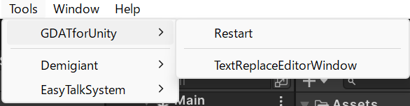
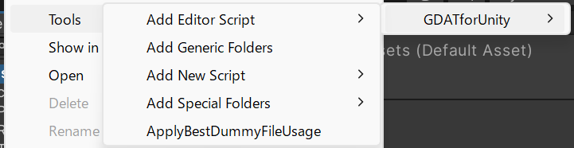
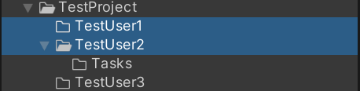
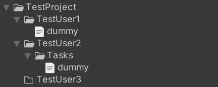
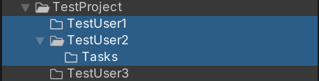
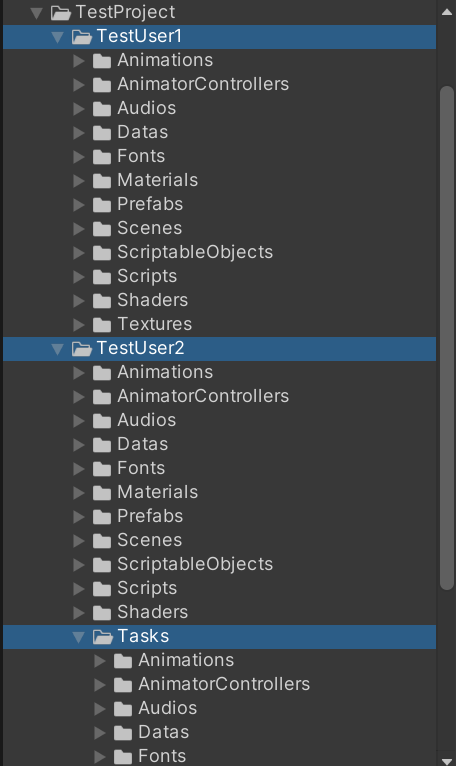
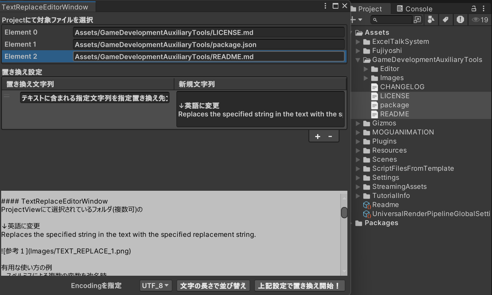

## REAME

Unityでの快適なゲーム開発を支援するエディタツールです。
下記から内包するエディターツールの名称とその概要をご覧ください。

ご使用される場合はツールバーの
`Tools/GDATforUnity/`(以降、所属ツールのはじめに「T/」と記載)もしくは
`Assets/Tools/GDATforUnity`(以降、所属ツールのはじめに「A/」と記載)に
存在する同名のツールからご利用いただけます。

> 
> 

#### A/ApplyBestDummyFileUsage
選択されたフォルダ以下に
適切なダミーファイルの使用状態を適用します。

空のフォルダにはdummyファイルを追加・
dummyファイル以外があるフォルダからは削除を行います。

使用前→使用後
> 
> 

使い方の例
- 進捗共有前
- 作品提出前

#### A/Add Generic Folders
ProjectViewにて選択されているフォルダ(複数可)に
汎用的なフォルダ(Scripts/Textures/etc...)を追加します。

使用前→使用後

生成

有用な使い方の例
- プロジェクト立ち上げ時の一括フォルダ作成
- 開発メンバー加入時

#### SpecialFolders
Assets以下に特別な意味を持つフォルダ(Resources, StreamingAssets, etc...)を追加します。

有用な使い方の例
- 名前のタイプミス防止

#### Restart
UnityEditorの再起動。

有用な使い方の例
- Editor拡張時の反映作業
- 原因不明のUnityEditorエラーの解決

#### TextReplaceEditorWindow
ProjectViewにて選択されているフォルダ(複数可)の
テキストに含まれる指定文字列を指定置き換え先文字列に置き換えます。

有用な使い方の例
- スペルミスによる複数の変数を改名時
- Templateスクリプトの文字の置き換え
